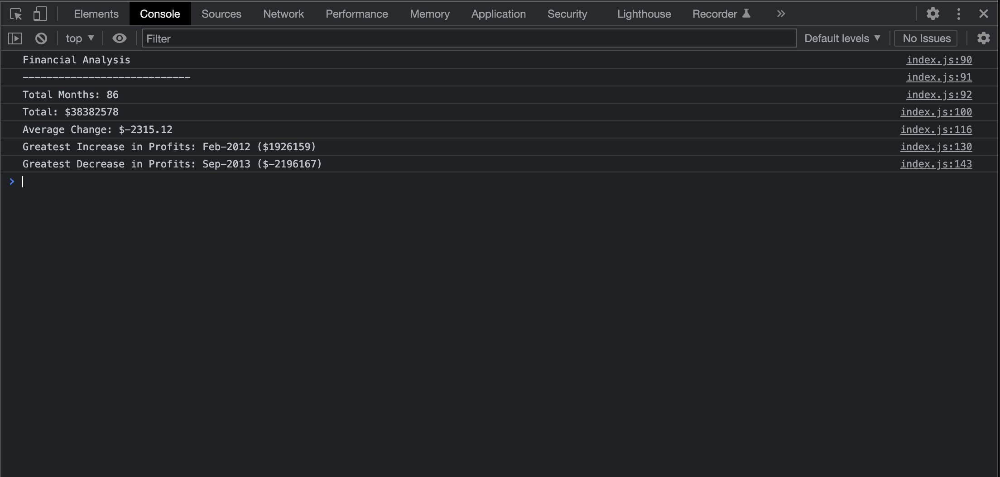

# Console-Finances

## Description 

I have completed the code after analyising the company finnancial records through the financial datset. I completed the javascript code calualtion for;

1. The total number of months included in the dataset.

2. The net total amount of Profit/Losses over the entire period.

3. The average of the changes in Profit/Losses over the entire period.

I also tracked what the total change in profits was from month to month and then find the average for the (Total/Number of months)

4. The greatest increase in profits (date and amount) over the entire period.

5. The greatest decrease in losses (date and amount) over the entire period.

I am getting more and more motivation as I go through the assignments as my learning is getting stronger and had a chance to illustarte my JavaScript skills.

## Screenshot

## Link
Your site is live at https://m0hammedzaber.github.io/Console-Finances/

## License 
MIT license
